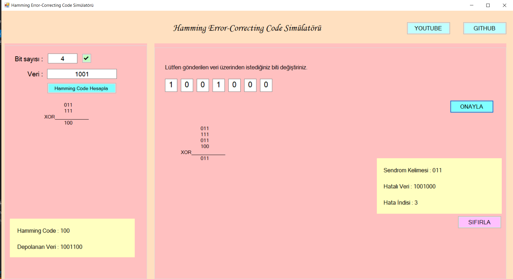
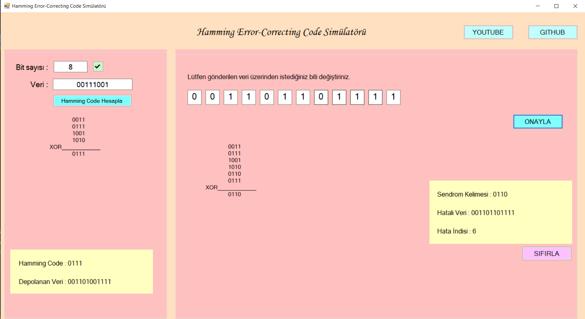
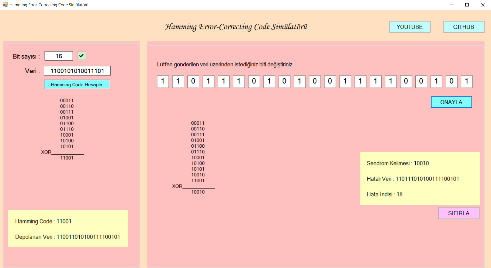

# Hamming Error-Correcting Code Simülatörü

Bu proje, Hamming Error-Correcting Code (Hamming Hata Düzeltme Kodu) simüle eden bir C# masaüstü uygulamasıdır. Kullanıcılar, hata düzeltme kodlarını kolayca oluşturabilir ve test edebilirler.





## Genel Bakış

Hamming Error-Correcting Code Simülatörü, kullanıcıların dijital veri iletiminde hataları tespit etmelerine ve düzeltmelerine yardımcı olmak için geliştirilmiştir. Uygulama, Hamming kodlarını kolayca oluşturmanızı, hataları simüle etmenizi ve bu hataları düzeltmenizi sağlar.

## Özellikler

- **Hamming Kodu Oluşturma:** Kullanıcılar, verilen bir veri bit dizisi için Hamming kodları oluşturabilir.
- **Hata Simülasyonu:** Hataları simüle ederek kodun sağlamlığını test edebilirsiniz.
- **Hata Tespiti ve Düzeltme:** Simüle edilen hataları tespit edebilir.

## Kurulum

Projeyi yerel makinenize kurmak için aşağıdaki adımları izleyin:

1. **Depoyu Klonlayın:**
    ```bash
    git clone https://github.com/kullaniciadi/HammingSimulasyonu.git
    ```
2. **Proje Dosyasını Açın:**
    - Visual Studio veya tercih ettiğiniz C# IDE'sini kullanarak `HammingSimulasyonu.sln` dosyasını açın.
3. **Gerekli Bağımlılıkları Yükleyin:**
    - NuGet paketlerini güncelleyin ve gerekli bağımlılıkları yükleyin.
4. **Uygulamayı Çalıştırın:**
    - Projeyi derleyin ve çalıştırın.

## Kullanım

Uygulamayı çalıştırdıktan sonra, aşağıdaki adımları takip edebilirsiniz:

1. **Veri Girişi:** Giriş verilerinizi ilgili alana girin.
2. **Hamming Kodu Oluşturma:** "Hamming Kodu Oluştur" butonuna tıklayarak kodu oluşturun.
3. **Hata Simülasyonu:** Hataları simüle etmek için "Hata Ekle" butonunu kullanın.
4. **Hata Tespiti ve Düzeltme:** "Hata Tespit ve Düzeltme" butonuna tıklayarak hataları tespit edin.

[Uygulama Videosu](https://youtu.be/QilxppfCjoI)

Teşekkürler ve iyi kodlamalar!
